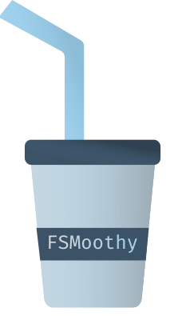
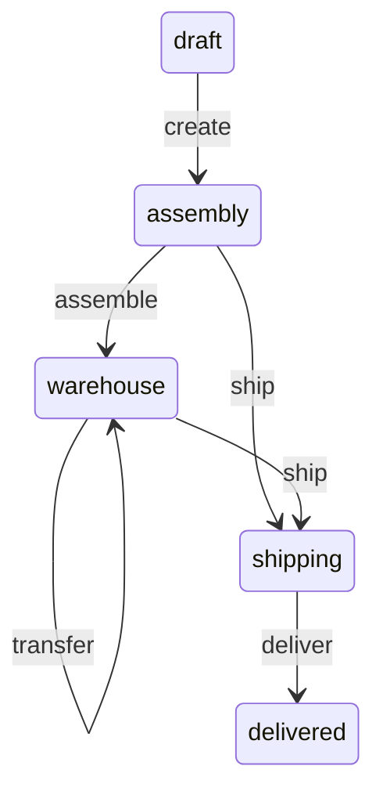

[](https://github.com/fsmoothy/fsmoothy)

[](http://commitizen.github.io/cz-cli/) [](https://codeclimate.com/github/fsmoothy/fsmoothy/maintainability) [](https://codeclimate.com/github/fsmoothy/fsmoothy/test_coverage)

`fsmoothy` is a TypeScript library for building functional state machines. It's inspired by [aasm](https://github.com/aasm/aasm) and provide magic methods for transitions.

## Index

- [Usage](#usage)
  - [Events and States](#events-and-states)
  - [State Machine](#state-machine)
  - [StateMachine Parameters](#statemachine-parameters)
  - [Transitions](#transitions)
  - [Make transition](#make-transition)
  - [Current state](#current-state)
  - [Transition availability](#transition-availability)
  - [Subscribers](#subscribers)
  - [Lifecycle](#lifecycle)
  - [Bound lifecycle methods](#bound-lifecycle-methods)
  - [Error handling](#error-handling)
- [Installation](#installation)
- [Examples](#examples)
- [Latest Changes](#latest-changes)

## Usage

Let's create a basic order state machine to showcase the features of the library. The diagram below illustrates the states and transitions of the state machine.



### Events and States

The library was initially designed to use `enums` for events and states. However, using string enums would provide more convenient method names. It is also possible to use `string` or `number` as event or state types, but this approach is not recommended.

```typescript
enum OrderItemState {
  draft = 'draft',
  assembly = 'assembly',
  warehouse = 'warehouse',
  shipping = 'shipping',
  delivered = 'delivered',
}

enum OrderItemEvent {
  create = 'create',
  assemble = 'assemble',
  transfer = 'transfer',
  ship = 'ship',
  deliver = 'deliver',
}

interface IOrderItemContext {
  place: string;
}
```

### State Machine

To create state machine, we need to instantiate `StateMachine` class and pass the initial state and the state transition table to the constructor.

```typescript
import { StateMachine, t } from 'fsmoothy';

const orderItemFSM = new StateMachine({
  id: 'orderItemsStatus',
  initial: OrderItemState.draft,
  ctx: {
    place: 'My warehouse',
  },
  transitions: [
    t(OrderItemState.draft, OrderItemEvent.create, OrderItemState.assembly),
    t(
      OrderItemState.assembly,
      OrderItemEvent.assemble,
      OrderItemState.warehouse,
    ),
    t(
      OrderItemState.warehouse,
      OrderItemEvent.transfer,
      OrderItemState.warehouse,
      {
        guard(context: IOrderItemContext, place: string) {
          return context.place !== place;
        },
        onExit(context: IOrderItemContext, place: string) {
          context.place = place;
        },
      },
    ),
    t(
      [OrderItemState.assembly, OrderItemState.warehouse],
      OrderItemEvent.ship,
      OrderItemState.shipping,
    ),
    t(
      OrderItemState.shipping,
      OrderItemEvent.deliver,
      OrderItemState.delivered,
    ),
  ],
});
```

### StateMachine Parameters

Let's take a look at the `IStateMachineParameters<State, Event, Context>` interface. It has the following properties:

- `id` - a unique identifier for the state machine (used for debugging purposes)
- `initial` - the initial state of the state machine
- `ctx` - initial context of the state machine
- `transitions` - an array of transitions
- `subscribers` - an object with subscribers array for events

### Transitions

The most common way to define a transition is by using the `t` function, which requires three arguments (guard is optional).

```typescript
t(from: State | State[], event: Event, to: State, guard?: (context: Context) => boolean);
```

We also able to pass optional `onEnter` and `onExit` functions to the transition as options:

```typescript
t(
  from: State | State[],
  event: Event,
  to: State,
  options?: {
    guard?: (context: Context) => boolean;
    onEnter?: (context: Context) => void;
    onExit?: (context: Context) => void;
  },
);
```

In such cases, we're using next options:

- `from` - represents the state from which the transition is permitted
- `event` - denotes the event that triggers the transition
- `to` - indicates the state to which the transition leads
- `guard` - a function that verifies if the transition is permissible
- `onEnter` - a function that executes when the transition is triggered
- `onExit` - a function that executes when the transition is completed

### Make transition

To make a transition, we need to call the `transition` method of the fsm or use methods with the same name as the event. State changes will persist to the database by default.

```typescript
await orderItemFSM.create();
await orderItemFSM.assemble();
await orderItemFSM.transfer('Another warehouse');
await orderItemFSM.ship();
```

We're passing the `place` argument to the `transfer` method. It will be passed to the `guard` and `onExit` functions.

### Dynamic add transitions

We can add transition dynamically using the `addTransition` method.

```typescript
const newOrderItemFSM = orderItemFSM.addTransition([
  t(
    OrderItemState.shipping,
    OrderItemEvent.transfer,
    OrderItemState.shipping,
    {
      guard(context: IOrderItemContext, place: string) {
        return context.place !== place;
      },
      onExit(context: IOrderItemContext, place: string) {
        context.place = place;
      },
    },
  ),
]);
```

It returns a new instance of the state machine with the added transition. Context and current state will be copied to the new instance.

### Current state

You can get the current state of the state machine using the `current` property.

```typescript
console.log(orderItemFSM.current); // draft
```

Also you can use `is` + `state name` method to check the current state.

```typescript
console.log(orderItemFSM.isDraft()); // true
```

Also `is(state: State)` method is available.

### Transition availability

You can check if the transition is available using the `can` + `event name` method.

```typescript
console.log(orderItemFSM.canCreate()); // true
await orderItemFSM.create();
console.log(orderItemFSM.canCreate()); // false
await orderItemFSM.assemble();
```

Arguments are passed to the `guard` function.

``` typescript
await orderItemFSM.transfer('Another warehouse');
console.log(orderItemFSM.canTransfer('Another warehouse')); // false
```

Also `can(event: Event, ...args)` method is available.

### Subscribers

You can subscribe to transition using the `on` method. And unsubscribe using the `off` method.

```typescript
const subscriber = (state: OrderItemState) => {
  console.log(state);
};
orderItemFSM.on(OrderItemEvent.create, subscriber);

await orderItemFSM.create();

orderItemFSM.off(OrderItemEvent.create, subscriber);
```

### Subscribers on initialization

Also you're able to subscribe to transaction on initialization.

```typescript
const orderItemFSM = new StateMachine({
  initial: OrderItemState.draft,
  transitions: [
    t(OrderItemState.draft, OrderItemEvent.create, OrderItemState.assembly),
    t(
      OrderItemState.assembly,
      OrderItemEvent.assemble,
      OrderItemState.warehouse,
    ),
    t(
      [OrderItemState.assembly, OrderItemState.warehouse],
      OrderItemEvent.ship,
      OrderItemState.shipping,
    ),
    t(
      OrderItemState.shipping,
      OrderItemEvent.deliver,
      OrderItemState.delivered,
    ),
  ],
  subscribers: {
    [OrderItemEvent.create]: [(state: OrderItemState) => {
      console.log(state);
    }]
  }
});
```

### Subscribers to all transitions

You can subscribe to all transitions using the `on` method without event name.

```typescript
const subscriber = (state: OrderItemState) => {
  console.log(state);
};
orderItemFSM.on(subscriber);
```

Subscriber will be called on all transitions after subscribers with event name.

### Nested state machines

`fsmoothy` supports nested state machines. It's the way to deal with the [state explosion problem](https://statecharts.dev/state-machine-state-explosion.html) of traditional finite state machines.

A crosswalk light is an example of a nested state machine. It displays a stop signal ✋ when the stoplight is either **Yellow** or **Green**., and switches to a walk signal 🚶‍♀️ when the stoplight turns **Red**. The crosswalk light operates as a nested state machine within the parent stoplight system.

```typescript
enum NestedStates {
  walk = 'walk',
  dontWalk = 'dontWalk',
}

enum NestedEvents {
  toggle = 'toggle',
}

enum State {
  green = 'green',
  yellow = 'yellow',
  red = 'red',
}

enum Event {
  next = 'next',
}

const fsm = new StateMachine<
  State | NestedStates,
  Event | NestedEvents,
  { test: string }
>({
  id: 'stoplight-fsm',
  initial: State.green,
  ctx: () => ({ test: 'bar' }),
  transitions: [
    t(State.green, Event.next, State.yellow),
    t(State.yellow, Event.next, State.red),
    t(State.red, Event.next, State.green),
  ],
  states: {
    [State.red]: nested({
      id: 'walk-fsm',
      initial: NestedStates.dontWalk,
      transitions: [
        t(NestedStates.dontWalk, NestedEvents.toggle, NestedStates.walk),
      ],
    }),
  },
});

await fsm.next();
await fsm.next(); // fsm.current === State.red
await fsm.toggle(); // fsm.current === NestedStates.walk
await fsm.next(); // fsm.current === State.green
fsm.is(NestedStates.walk); // false
```

### Lifecycle

The state machine has the following lifecycle methods in the order of execution:

```
- guard
- onLeave (from previous transition)
- onEnter
- transition
- subscribers
- onExit
```

### Bound lifecycle methods

You can access the fsm instance using `this` keyword.

```typescript
orderItemFSM.onEnter(function () {
  console.log(this.current);
});
orderItemFSM.on(OrderItemEvent.create, function () {
  console.log(this.current);
});

await orderItemFSM.create();
```

### Error handling

Library throws `StateMachineError` if transition is not available. It can be caught using `try/catch` and checked using `isStateMachineError` function.

```typescript
import { isStateMachineError } from 'typeorm-fsm';

try {
  await orderItemFSM.create();
} catch (error) {
  if (isStateMachineError(error)) {
    console.log(error.message);
  }
}
```

## Installation

```bash
npm install fsmoothy
```

## Examples

Check out the [examples](./src/__tests__/examples) directory for more examples.

## Latest Changes

Take a look at the [CHANGELOG](CHANGELOG.md) for details about recent changes to the current version.
