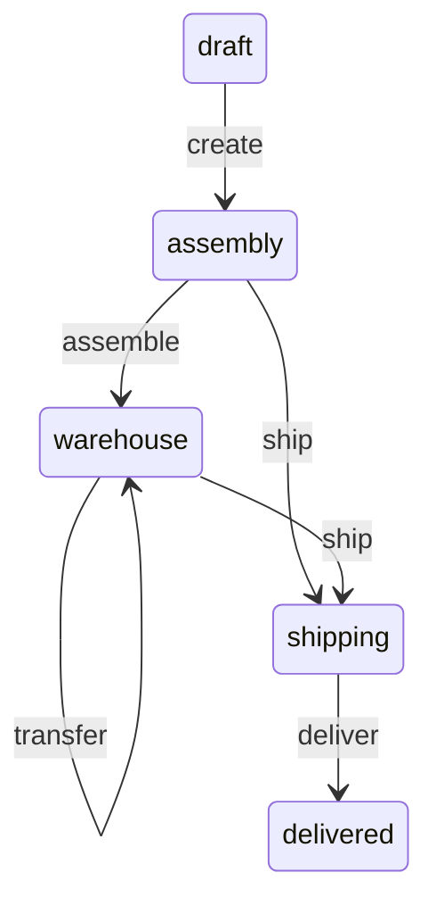

# FSMoothy core

[](http://commitizen.github.io/cz-cli/) [](https://codeclimate.com/github/fsmoothy/fsmoothy/maintainability) [](https://codeclimate.com/github/fsmoothy/fsmoothy/test_coverage)

`fsmoothy` is a TypeScript library for building state machines. It's inspired by [aasm](https://github.com/aasm/aasm) and provide magic methods for transitions.

## Index

- [Installation](#installation)
- [Usage](#usage)
  - [Events and States](#events-and-states)
  - [State Machine](#state-machine)
  - [StateMachine Parameters](#statemachine-parameters)
  - [Transitions](#transitions)
  - [Make transition](#make-transition)
  - [Conditional transitions](#conditional-transitions)
  - [Current state](#current-state)
  - [Transition availability](#transition-availability)
  - [Subscribers](#subscribers)
  - [Lifecycle](#lifecycle)
  - [Bound lifecycle methods](#bound-lifecycle-methods)
  - [Dependency injection](#dependency-injection)
  - [Error handling](#error-handling)
- [Examples](#examples)
- [Latest Changes](#latest-changes)

## Installation

```bash
npm install @fsmoothy/core
```

## Usage

Let's create a basic order state machine to showcase the features of the library. The diagram below illustrates the states and transitions of the state machine.



### Events and States

There are several ways to define states and events. We recommend using `defineStates`/`defineEvents` helpers for the best developer experience.

#### Option 1: `defineStates`/`defineEvents` helpers (recommended)

```typescript
import { defineStates, defineEvents, FsmContext } from '@fsmoothy/core';

const OrderItemState = defineStates('draft', 'assembly', 'warehouse', 'shipping', 'delivered');
type OrderItemState = typeof OrderItemState.type;

const OrderItemEvent = defineEvents('create', 'assemble', 'transfer', 'ship', 'deliver');
type OrderItemEvent = typeof OrderItemEvent.type;

type OrderItemContext = FsmContext<{
  place: string;
}>
```

#### Option 2: `as const` objects

```typescript
const OrderItemState = {
  draft: 'draft',
  assembly: 'assembly',
  warehouse: 'warehouse',
  shipping: 'shipping',
  delivered: 'delivered',
} as const;
type OrderItemState = (typeof OrderItemState)[keyof typeof OrderItemState];

const OrderItemEvent = {
  create: 'create',
  assemble: 'assemble',
  transfer: 'transfer',
  ship: 'ship',
  deliver: 'deliver',
} as const;
type OrderItemEvent = (typeof OrderItemEvent)[keyof typeof OrderItemEvent];

type OrderItemContext = FsmContext<{
  place: string;
}>
```

#### Option 3: Union types (minimalist)

For simple cases, you can use plain union types:

```typescript
type OrderItemState = 'draft' | 'assembly' | 'warehouse' | 'shipping' | 'delivered';
type OrderItemEvent = 'create' | 'assemble' | 'transfer' | 'ship' | 'deliver';

// Usage with string literals
const fsm = new StateMachine<OrderItemState, OrderItemEvent>({
  initial: 'draft',
  transitions: [
    t('draft', 'create', 'assembly'),
    // ...
  ],
});
```

#### Option 4: Enums (legacy)

While still supported, enums are considered less idiomatic in modern TypeScript:

```typescript
enum OrderItemState {
  draft = 'draft',
  assembly = 'assembly',
  warehouse = 'warehouse',
  shipping = 'shipping',
  delivered = 'delivered',
}

enum OrderItemEvent {
  create = 'create',
  assemble = 'assemble',
  transfer = 'transfer',
  ship = 'ship',
  deliver = 'deliver',
}
```

### State Machine

To create state machine, we need to instantiate `StateMachine` class and pass the initial state and the state transition table to the constructor.

```typescript
import { StateMachine, t, FsmContext, defineStates, defineEvents } from '@fsmoothy/core';

// Define states and events using helpers
const OrderItemState = defineStates('draft', 'assembly', 'warehouse', 'shipping', 'delivered');
type OrderItemState = typeof OrderItemState.type;

const OrderItemEvent = defineEvents('create', 'assemble', 'transfer', 'ship', 'deliver');
type OrderItemEvent = typeof OrderItemEvent.type;

type OrderItemContext = FsmContext<{
  place: string;
}>;

const orderItemFSM = new StateMachine<
  OrderItemState,
  OrderItemEvent,
  OrderItemContext
>({
  id: 'orderItemsStatus',
  initial: OrderItemState.draft,
  data: () => ({
    place: 'My warehouse',
  }),
  transitions: [
    t(OrderItemState.draft, OrderItemEvent.create, OrderItemState.assembly),
    t(
      OrderItemState.assembly,
      OrderItemEvent.assemble,
      OrderItemState.warehouse,
    ),
    t(
      OrderItemState.warehouse,
      OrderItemEvent.transfer,
      OrderItemState.warehouse,
      {
        guard(context, place: string) {
          return context.data.place !== place;
        },
        onExit(context, place: string) {
          context.data.place = place;
        },
      },
    ),
    t(
      [OrderItemState.assembly, OrderItemState.warehouse],
      OrderItemEvent.ship,
      OrderItemState.shipping,
    ),
    t(
      OrderItemState.shipping,
      OrderItemEvent.deliver,
      OrderItemState.delivered,
    ),
  ],
});
```

### StateMachine Parameters

Let's take a look at the `IStateMachineParameters<State, Event, Context>` interface. It has the following properties:

- `id` - a unique identifier for the state machine (used for debugging purposes)
- `initial` - the initial state of the state machine
- `data` - initializer for initial data of the state machine (it can return a promise, if so the data will be initialized after first transition)
- `transitions` - an array of transitions
- `subscribers` - an object with subscribers array for events
- `states` - a fabric function that returns an object with nested state machines

### Transitions

The most common way to define a transition is by using the `t` function, which requires three arguments (guard is optional).

```typescript
t(from: State | State[], event: Event, to: State, guard?: (context: Context) => boolean);
```

We also able to pass optional `onEnter` and `onExit` functions to the transition as options:

```typescript
t(
  from: State | State[],
  event: Event,
  to: State,
  options?: {
    guard?: (context: Context) => boolean;
    onEnter?: (context: Context) => void;
    onExit?: (context: Context) => void;
  },
);
```

In such cases, we're using next options:

- `from` - represents the state **from** which the transition is permitted
- `event` - denotes the _event_ that triggers the transition
- `to` - indicates the state **to** which the transition leads
- `guard` - a function that verifies if the transition is permissible
- `onEnter` - a function that executes when the transition is triggered
- `onExit` - a function that executes when the transition is completed
- `onLeave` - a function that executes when the next transition is triggered (before `onEnter` of the next transition)

### Make transition

To make a transition, we need to call the `transition` method of the fsm or use methods with the same name as the event. State changes will persist to the database by default.

```typescript
await orderItemFSM.create();
await orderItemFSM.assemble();
await orderItemFSM.transfer('Another warehouse');
await orderItemFSM.ship();
```

We're passing the `place` argument to the `transfer` method. It will be passed to the `guard` and `onExit` functions.

### Conditional transitions

We can use the `guard` function to make a transition conditional.

```typescript
const State = defineStates('idle', 'pending', 'resolved');
type State = typeof State.type;

const Event = defineEvents('fetch', 'reset');
type Event = typeof Event.type;

const stateMachine = new StateMachine<State, Event, FsmContext<{ foo: string }>>({
  initial: State.idle,
  data: () => ({ foo: 'bar' }),
  transitions: [
    t(State.idle, Event.fetch, State.pending, {
      guard: (context) => context.data.foo === 'bar',
    }),
    t(State.idle, Event.fetch, State.resolved, {
      guard: (context) => context.data.foo === 'foo',
    }),
    t(All, Event.reset, State.idle),
  ],
});

await stateMachine.fetch(); // now current state is pending

await stateMachine.reset();
stateMachine.data.foo = 'foo';
await stateMachine.fetch(); // now current state is resolved
```

It will moving to the next state only if the `guard` function returns `true`.

### Dynamic add and remove transitions

We can add transition dynamically using the `addTransition` method.

```typescript
orderItemFSM.addTransition(
  OrderItemState.shipping,
  OrderItemEvent.transfer,
  OrderItemState.shipping,
  {
    guard(context: OrderItemContext, place: string) {
      return context.data.place !== place;
    },
    onExit(context: OrderItemContext, place: string) {
      context.data.place = place;
    },
  },
);
```

You're also able to remove transitions using `removeTransition` method.

### Current state

You can get the current state of the state machine using the `current` property.

```typescript
console.log(orderItemFSM.current); // draft
```

Also you can use `is` + `state name` method to check the current state.

```typescript
console.log(orderItemFSM.isDraft()); // true
```

Also `is(state: State)` method is available.

### Transition availability

You can check if the transition is available using the `can` + `event name` method.

```typescript
console.log(orderItemFSM.canCreate()); // true
await orderItemFSM.create();
console.log(orderItemFSM.canCreate()); // false
await orderItemFSM.assemble();
```

Arguments are passed to the `guard` function.

``` typescript
await orderItemFSM.transfer('Another warehouse');
console.log(orderItemFSM.canTransfer('Another warehouse')); // false
```

Also `can(event: Event, ...args)` method is available.

#### Try transition

We also can use `tryTransition` method to check if the transition is available and make it.

```typescript
await orderItemFSM.tryTransition(OrderItemEvent.create) // true
```

It returns `false` if the transition is not available instead of throwing an error.

### Subscribers

You can subscribe to transition using the `on` method. And unsubscribe using the `off` method.

```typescript
const subscriber = (state: OrderItemState) => {
  console.log(state);
};
orderItemFSM.on(OrderItemEvent.create, subscriber);

await orderItemFSM.create();

orderItemFSM.off(OrderItemEvent.create, subscriber);
```

### Subscribers on initialization

Also you're able to subscribe to transaction on initialization.

```typescript
const orderItemFSM = new StateMachine({
  initial: OrderItemState.draft,
  transitions: [
    t(OrderItemState.draft, OrderItemEvent.create, OrderItemState.assembly),
    t(
      OrderItemState.assembly,
      OrderItemEvent.assemble,
      OrderItemState.warehouse,
    ),
    t(
      [OrderItemState.assembly, OrderItemState.warehouse],
      OrderItemEvent.ship,
      OrderItemState.shipping,
    ),
    t(
      OrderItemState.shipping,
      OrderItemEvent.deliver,
      OrderItemState.delivered,
    ),
  ],
  subscribers: {
    [OrderItemEvent.create]: [(state: OrderItemState) => {
      console.log(state);
    }]
  }
});
```

### Subscribers to all transitions

You can subscribe to all transitions using the `on` method without event name.

```typescript
const subscriber = (state: OrderItemState) => {
  console.log(state);
};
orderItemFSM.on(subscriber);
```

Subscriber will be called on all transitions after subscribers with event name.

### Nested state machines

`fsmoothy` supports nested state machines. It's the way to deal with the [state explosion problem](https://statecharts.dev/state-machine-state-explosion.html) of traditional finite state machines.

A crosswalk light is an example of a nested state machine. It displays a stop signal ✋ when the stoplight is either **Yellow** or **Green**., and switches to a walk signal 🚶‍♀️ when the stoplight turns **Red**. The crosswalk light operates as a nested state machine within the parent stoplight system.

```typescript
const NestedState = defineStates('walk', 'dontWalk');
type NestedState = typeof NestedState.type;

const NestedEvent = defineEvents('toggle');
type NestedEvent = typeof NestedEvent.type;

const State = defineStates('green', 'yellow', 'red');
type State = typeof State.type;

const Event = defineEvents('next');
type Event = typeof Event.type;

const fsm = new StateMachine<
  State | NestedState,
  Event | NestedEvent,
  never,
>({
  id: 'stoplight-fsm',
  initial: State.green,
  transitions: [
    t(State.green, Event.next, State.yellow),
    t(State.yellow, Event.next, State.red),
    t(State.red, Event.next, State.green),
  ],
  states: () => ({
    [State.red]: nested({
      id: 'walk-fsm',
      initial: NestedState.dontWalk,
      transitions: [
        t(NestedState.dontWalk, NestedEvent.toggle, NestedState.walk),
      ],
    }),
  }),
});

await fsm.next();
await fsm.next(); // fsm.current === State.red
await fsm.toggle(); // fsm.current === NestedState.walk
await fsm.next(); // fsm.current === State.green
fsm.is(NestedState.walk); // false
```

`states` property is a fabric function that returns an object with nested state machines. It's called only once on initialization.

You're also able to remove child state using `removeState` method.

### Lifecycle

The state machine has the following lifecycle methods in the order of execution:

```
- guard
- onLeave (from previous transition)
- onEnter
- transition
- subscribers
- onExit
```

### Bound lifecycle methods

You can access the fsm instance using `this` keyword.

```typescript
orderItemFSM.on(function () {
  console.log(this.current);
});
orderItemFSM.on(OrderItemEvent.create, function () {
  console.log(this.current);
});

await orderItemFSM.create();
```

### Dependency injection

You can pass dependencies to the fsm using the `inject` property.

```typescript
const State = defineStates('idle', 'pending', 'resolved');
type State = typeof State.type;

const Event = defineEvents('fetch', 'reset');
type Event = typeof Event.type;

type MyContext = FsmContext<{
  foo: string;
}> & {
  logger: Logger;
};

const stateMachine = new StateMachine<State, Event, MyContext>({
  initial: State.idle,
  data: () => ({ foo: 'bar' }),
  transitions: [
    t(State.idle, Event.fetch, State.pending, {
      guard: (context) => context.data.foo === 'bar',
    }),
    t(State.idle, Event.fetch, State.resolved, {
      guard: (context) => context.data.foo === 'foo',
    }),
    t(All, Event.reset, State.idle),
  ],
  inject: {
    logger: async (fsm) => new Logger(fsm),
  },
});
```

Logger will be resolve on first transition.

There is also a `inject` and `injectAsync` method that allows you to add dependencies dynamically.

```typescript
stateMachine.inject('logger', new Logger(fsm));
stateMachine.injectAsync('logger', async (fsm) => new Logger(fsm)); // factory function
```

### Error handling

Library throws `StateMachineTransitionError` if transition is not available. It can be caught using `try/catch` and checked using `isStateMachineTransitionError` function.

```typescript
import { isStateMachineTransitionError } from '@fsmoothy/core';

try {
  await orderItemFSM.create();
} catch (error) {
  if (isStateMachineTransitionError(error)) {
    console.log(error.message);
  }
}
```

If any of your errors occur in the lifecycle methods, they will be passed as they are to the catch block.

### Hydrate and dehydrate

You can use `dehydrate` and `hydrate`  methods to convert FSM state to a plain object and back to a state machine instance.

```typescript
const state = orderItemFSM.dehydrate();
// { "current": "draft", "data": { "place": "My warehouse" } }

orderItemFSM.hydrate(state);
```

## Examples

Check out the [examples](./src/__tests__/examples) directory for more examples.

## Latest Changes

Take a look at the [CHANGELOG](CHANGELOG.md) for details about recent changes to the current version.
