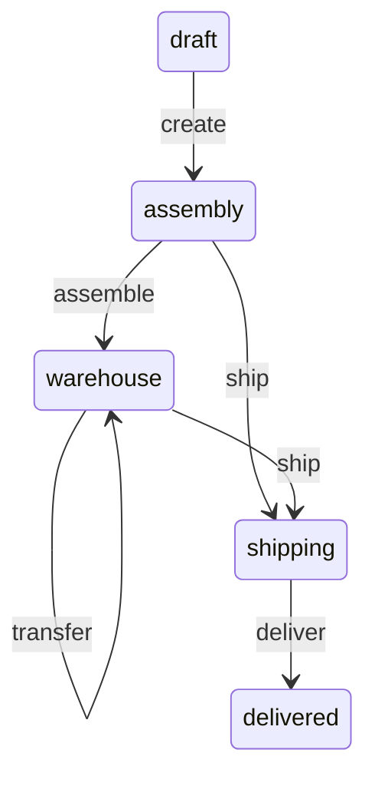

# TypeORM State Machine

`@fsmoothy/typeorm` is a strongly typed state machine designed for TypeORM entities. It allows you to define and manage state transitions in a declarative manner. The library is using [fsmoothy](https://github.com/fsmoothy/fsmoothy) package to provide the best DX.

## Index

- [Usage](#usage)
  - [Events and States](#events-and-states)
  - [Entity](#entity)
  - [StateMachineEntity](#statemachineentity)
  - [Transitions](#transitions)
  - [Make transition](#make-transition)
  - [Current state](#current-state)
  - [Transition availability](#transition-availability)
  - [Subscribers](#subscribers)
  - [Lifecycle](#lifecycle)
  - [Bound lifecycle methods](#bound-lifecycle-methods)
  - [Error handling](#error-handling)
- [Installation](#installation)
- [Examples](#examples)
- [Latest Changes](#latest-changes)
- [Thanks](#thanks)

## Usage

Let's create a basic order state machine to showcase the features of the library. The diagram below illustrates the states and transitions of the state machine.



### Events and States

The library was initially designed to use `enums` for events and states. However, using string enums would provide more convenient method names. It is also possible to use `string` or `number` as event or state types, but this approach is not recommended.

```typescript
enum OrderItemState {
  draft = 'draft',
  assembly = 'assembly',
  warehouse = 'warehouse',
  shipping = 'shipping',
  delivered = 'delivered',
}

enum OrderItemEvent {
  create = 'create',
  assemble = 'assemble',
  transfer = 'transfer',
  ship = 'ship',
  deliver = 'deliver',
}

interface IOrderItemContext = FSMContext<{
  place: string;
}>
```

### Entity

To create an entity class, it must extend `StateMachineEntity` and have defined initial state and transitions. Additionally, you can combine `StateMachineEntity` with your own `BaseEntity`, which should be extended from TypeORM's base entity.

```typescript
@Entity('order')
class Order extends StateMachineEntity(
  {
    itemsStatus: state<OrderItemState, OrderItemEvent, IOrderItemContext>({
      id: 'orderItemsStatus',
      initial: OrderItemState.draft,
      data: () => ({
        place: 'My warehouse',
      }),
      transitions: [
        t(OrderItemState.draft, OrderItemEvent.create, OrderItemState.assembly),
        t(
          OrderItemState.assembly,
          OrderItemEvent.assemble,
          OrderItemState.warehouse,
        ),
        {
          from: OrderItemState.warehouse,
          event: OrderItemEvent.transfer,
          to: OrderItemState.warehouse,
          guard(context, place: string) {
            return context.data.place !== place;
          },
          onExit(context:, place: string) {
            context.data.place = place;
          },
        },
        t(
          [OrderItemState.assembly, OrderItemState.warehouse],
          OrderItemEvent.ship,
          OrderItemState.shipping,
        ),
        t(
          OrderItemState.shipping,
          OrderItemEvent.deliver,
          OrderItemState.delivered,
        ),
      ],
    }),
  },
) {
  @Column({
    default: 0,
  })
  price: number;
}
```

### StateMachineEntity

Let's take a look at the `StateMachineEntity` mixin. It accepts an object with the following properties:

- `id` - a unique identifier for the state machine (used for debugging purposes)
- `initial` - the initial state of the state machine
- `saveAfterTransition` - if `true`, the state machine will be saved to the database after each transition. Default value is `true`
- `data` - initial data for the state machine context
- `transitions` - an array of transitions
- `subscribers` - an object with subscribers array for events

It also support extend your own `BaseEntity` class by passing it as a second argument.

### Transitions

The most common way to define a transition is by using the `t` function, which requires three arguments (guard is optional).

```typescript
t(from: State | State[], event: Event, to: State, guard?: (context: Context) => boolean);
```

We also able to pass optional `onEnter` and `onExit` functions to the transition as options:

```typescript
t(
  from: State | State[],
  event: Event,
  to: State,
  options?: {
    guard?: (context: Context) => boolean;
    onEnter?: (context: Context) => void;
    onExit?: (context: Context) => void;
  },
);
```

In such cases, we're using next options:

- `from` - represents the state from which the transition is permitted
- `event` - denotes the event that triggers the transition
- `to` - indicates the state to which the transition leads
- `guard` - a function that verifies if the transition is permissible
- `onEnter` - a function that executes when the transition is triggered
- `onExit` - a function that executes when the transition is completed
- `onLeave` - a function that executes when the next transition is triggered (before `onEnter`)

### Make transition

To make a transition, we need to call the `transition` method of the entity or use methods with the same name as the event. State changes will persist to the database by default.

```typescript
const order = new Order();
await order.fsm.itemsStatus.create();
await order.fsm.itemsStatus.assemble();
await order.fsm.itemsStatus.transfer('Another warehouse');
await order.fsm.itemsStatus.ship();
```

We're passing the `place` argument to the `transfer` method. It will be passed to the `guard` and `onExit` functions.

### Dynamic add transitions

We can add transition dynamically using the `addTransition` method.

```typescript
orderItemFSM.addTransition([
  t(
    OrderItemState.shipping,
    OrderItemEvent.transfer,
    OrderItemState.shipping,
    {
      guard(context: IOrderItemContext, place: string) {
        return context.data.place !== place;
      },
      onExit(context: IOrderItemContext, place: string) {
        context.data.place = place;
      },
    },
  ),
]);
```

### Current state

You can get the current state of the state machine using the `current` property.

```typescript
const order = new Order();
console.log(order.fsm.itemsStatus.current); // draft
```

Also you can use `is` + `state name` method to check the current state.

```typescript
const order = new Order();
console.log(order.fsm.itemsStatus.isDraft()); // true
```

Also `is(state: State)` method is available.

### Transition availability

You can check if the transition is available using the `can` + `event name` method.

```typescript
const order = new Order();

console.log(order.fsm.itemsStatus.canCreate()); // true
await order.fsm.itemsStatus.create();
console.log(order.fsm.itemsStatus.canCreate()); // false
await order.fsm.itemsStatus.assemble();
```

Arguments are passed to the `guard` function.

``` typescript
await order.fsm.itemsStatus.transfer('Another warehouse');
console.log(order.fsm.itemsStatus.canTransfer('Another warehouse')); // false
```

Also `can(event: Event, ...args)` method is available.

### Subscribers

You can subscribe to transition using the `on` method. And unsubscribe using the `off` method.

```typescript
const order = new Order();

const subscriber = (state: OrderItemState) => {
  console.log(state);
};
order.fsm.itemsStatus.on(OrderItemEvent.create, subscriber);

await order.fsm.itemsStatus.create();

order.fsm.itemsStatus.off(OrderItemEvent.create, subscriber);
```

### Lifecycle

The state machine has the following lifecycle methods in the order of execution:

```
- guard
- onLeave (from previous transition)
- onEnter
- transition
- subscribers
- onExit
```

### Bound lifecycle methods

The entity instance will be bound to the lifecycle methods. You can access the entity instance using `this` keyword.

```typescript
const order = new Order();

order.fsm.itemsStatus.onEnter(function (this: Order) {
  console.log(this.id);
});
order.fsm.itemStatus.on(OrderItemEvent.create, function (this: Order) {
  console.log(this.id);
});

await order.fsm.itemsStatus.create();
```

You also able to use `bind` method to bind your own `this` keyword to the function.

```typescript
order.fsm.itemsStatus.on(function () {
  console.log(this.current);
}.bind({ current: 'test' }));
```

### Error handling

Library throws `StateMachineError` if transition is not available. It can be caught using `try/catch` and checked using `isStateMachineError` function.

```typescript
import { isStateMachineError } from 'typeorm-fsm';

try {
  await order.fsm.itemsStatus.create();
} catch (error) {
  if (isStateMachineError(error)) {
    console.log(error.message);
  }
}
```

## Installation

```bash
npm install typeorm @fsmoothy/typeorm
```

## Examples

Check out the [examples](./src/__tests__/examples) directory for more examples.

## Latest Changes

Take a look at the [CHANGELOG](CHANGELOG.md) for details about recent changes to the current version.

## Thanks

This project was inspired by [aasm](https://github.com/aasm/aasm) and [typescript-fsm](https://github.com/eram/typescript-fsm).

And thank you for reading this far. I hope you find this library useful.
